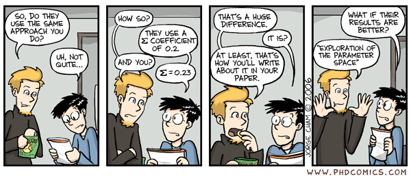

# (RE-)PACRR Neural IR models

This is a Keras (TensorFlow) implementation of the model described in:

Kai Hui, Andrew Yates, Klaus Berberich, Gerard de Melo.
[PACRR: A Position-Aware Neural IR Model for Relevance Matching](https://arxiv.org/pdf/1704.03940.pdf).
*In EMNLP, 2017.*

Kai Hui, Andrew Yates, Klaus Berberich, Gerard de Melo.
[RE-PACRR: A Context and Density-Aware Neural Information Retrieval Model](https://arxiv.org/pdf/1706.10192.pdf).
*In Neu-IR workshop, 2017.*

Andrew Yates, Kai Hui.
[DE-PACRR: Exploring Layers Inside the PACRR Model](https://arxiv.org/pdf/1706.08746.pdf).
*In Neu-IR '17.*

Kai Hui, Andrew Yates, Klaus Berberich, Gerard de Melo.
[Co-PACRR: A Context-Aware Neural IR Model for Ad-hoc Retrieval](https://arxiv.org/pdf/1706.10192.pdf).
*In WSDM '18*

## Contact

***Code authors:*** [Kai Hui](https://people.mpi-inf.mpg.de/~khui/), [Andrew Yates](https://andrewyates.net/), and
[Abhinav Madahar](https://abhinavmadahar.com)

***Pull requests and issues:*** @khui @andrewyates

## Model overview

*(RE-)PACRR* models the interaction between a query and a document to evaluate
the relevance of the document to the query. The input is the similarity matrix
comparing the query and the document, and the output is a scalar. The full
pipeline of the model will be published soon.

## Getting Started

This code runs on Python 2.

### Install Required Packages

First, we recommend installing Anaconda, which can be found
([here](https://www.continuum.io/downloads))

In addition, many of the required Python packages are available on pip, so it
is recommended that you install pip.

Instead of installing everything manually, you may want to use the `install`
script, which uses pip and is POSIX-compatible.

If you would prefer to install manually, please install these packages:

* **TensorFlow** ([instructions](https://www.tensorflow.org/install/))
* **Keras** ([instructions](https://keras.io/#installation))
* **numpy** and **scipy** ([instructions](https://www.scipy.org/install.html))
* **sacred** ([instruction](http://sacred.readthedocs.io/en/latest/quickstart.html#installation))

## Preparation: word2vec and similarity matrices

The model accepts a query-document matrix, so you need to supply them.
Fortunately, we already generated the matrices for clueweb as described in
(RE-)PACRR, which you can download from
[here](https://drive.google.com/file/d/0B3FrsWe6Y5YqdEtfSjI4N0h1LXM/view?usp=sharing)
and then extract using `tar xvf simmat.tar.gz`. This may take a few minutes.

If you would rather generate the matrices manually, please:

1. Extract the text from your WARC file

2. Get a pretrained word2vec corpus

3. Add vectors for the terms which are not included in the pretrained word2vec
   corpus. You can do so by running the `train_w2v.py` file, adds new vectors
   and improves those already present.

4. Compute the similarity matrices for individual query-document pairs. This is
   not included in the code, so you will have to do so manually.

## Usage: train, predict and evaluation

The `set\_env` script in the `bin` directory declares the environment variables
which are run in all other scripts in `bin`. If you want to replicate our
results, then don't worry about changing the variables in `set\_env`. If you
want to explore the parameter space, then change something in `set\_env` before
you try changing someone elsewhere in the code to be safe.



`parentdir` is the root directory for all outputs.

### Train

To train the model, we recommend running the `train\_model` script in bin. If
you would prefer to train directly, then run the command

```bash
python -m train\_model with expname=$expname train\_years=$train\_years {param\_name=param\_val}
```

### Predict
We recommend that you use the `pred\_per\_epoch` script in bin to predict. If
you would prefer to train directly, then run the command

```bash
python -m pred\_per\_epoch with expname=$expname train\_years=$train\_years test\_year=$test\_year {param\_name=param\_val}
```

### Evaluation

You can evaluate the model's prediction over the three benchmarks as described
in our RE-PACRR paper.

Before evaluating, make sure that you dumped [all the adhoc
trec-runs](http://trec.nist.gov/results/) from 2009 through 2014 into
utils/data/trec\_run and their corresponding evaluation results into
utils/data/eval\_trec\_runs. These are needed for Rerank-ALL.

Our evaluation code generates the exp that we reported in our PACRR and REPACRR
papers, but you can develop a different evaluation pipeline to use a different
dataset or benchmark.

For example, the usage of the six years' Web Track for training/validation/test
is hard coded in the train\_test\_years in utils/config.py, and one needs to
edit it when fewer years are used.

To evaluate the model, you can run the `evals` script in bin or run the following commands:

```bash
python -m evals.docpairs with expname=$expname train\_years=$train\_years {param\_name=param\_val}
python -m evals.rerank with expname=$expname train\_years=$train\_years {param\_name=param\_val}
```

## Citation

If you use the code, please cite the following papers:

### PACRR

```latex
@inproceedings{hui2017pacrr,
	title={PACRR: A Position-Aware Neural IR Model for Relevance Matching},
	author={Hui, Kai and Yates, Andrew and Berberich, Klaus and de Melo, Gerard},
	booktitle={Proceedings of the 2017 Conference on Empirical Methods in Natural Language Processing},
	pages={1060--1069},
	year={2017}
}
```

### RE-PACRR

```latex
@inproceedings{hui2017re,
	title={RE-PACRR: A Context and Density-Aware Neural Information Retrieval Model},
	author={Hui, Kai and Yates, Andrew and Berberich, Klaus and de Melo, Gerard},
	booktitle={The SIGIR 2017 Workshop on Neural Information Retrieval},
	year={2017}
}
```

### DE-PACRR

```latex
@inproceedings{hui2017de,
	title={DE-PACRR: Exploring Layers Inside the PACRR Model},
	author={Hui, Kai and Yates, Andrew},
	booktitle={The SIGIR 2017 Workshop on Neural Information Retrieval},
	year={2017}
```

### CO-PACRR

```latex
@inproceedings{hui2017co,
	title={Co-PACRR: A Context-Aware Neural IR Model for Ad-hoc Retrieval},
	author={Hui, Kai and Yates, Andrew and Berberich, Klaus and de Melo, Gerard},
	booktitle={Proceedings of the Eleventh ACM International Conference on Web Search and Data Mining},
	year={2017}
```
